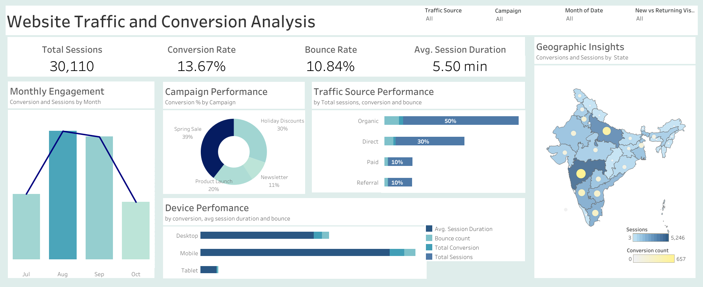

## Web-Traffic-Analysis
### Overview
This project focuses on creating an interactive Tableau dashboard to analyze Swiggy’s website traffic, user behavior, and conversion metrics. The goal is to help Swiggy’s marketing team improve engagement and drive revenue growth.

### Features
- Comprehensive KPIs like bounce rate, session duration, and conversion rate.
- Drill-down capabilities by traffic source, device type, and geography.
- Interactive filters for dynamic data exploration.
- Visual storytelling using charts like funnels, bar graphs, and line charts.

### Tech Stack
- **Dashboard Tool**: Tableau
- **Dataset**: Web traffic data (CSV format)

### Usage
1. Import web traffic data into Tableau.
2. Design a dashboard with KPIs, visualizations, and filters.
3. Use insights to optimize digital strategies and improve conversions.

